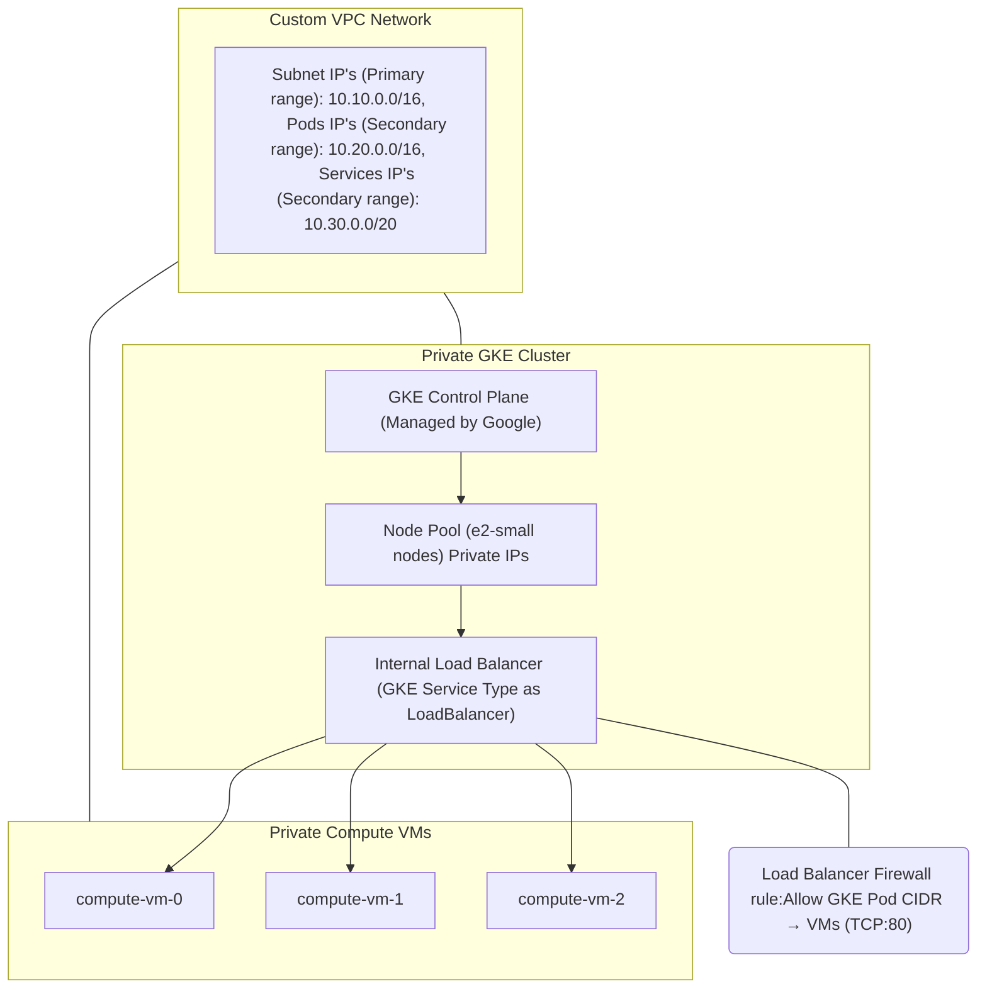

```mermaid
flowchart TB

    %% === VPC & Subnet ===
    subgraph VPC["Custom VPC Network"]
        direction TB
        Subnet["Subnet IP's (Primary range): 10.10.0.0/16, 
        Pods IP's (Secondary range): 10.20.0.0/16, 
        Services IP's (Secondary range): 10.30.0.0/20"]
    end

    %% === GKE Cluster ===
    subgraph GKE["Private GKE Cluster"]
        direction TB
        ControlPlane["GKE Control Plane (Managed by Google)"]
        NodePool["Node Pool (e2-small nodes) Private IPs"]
        ILB["Internal Load Balancer (GKE Service Type as LoadBalancer)"]

        ControlPlane --> NodePool
        NodePool --> ILB
    end

    %% === Backend VMs ===
    subgraph Backend["Private Compute VMs"]
        direction LR
        VM0["compute-vm-0"]
        VM1["compute-vm-1"]
        VM2["compute-vm-2"]
    end

    %% Relationships
    VPC --- GKE
    VPC --- Backend

    %% Firewall rules annotation
    ILB --- Note1("Load Balancer Firewall rule:Allow GKE Pod CIDR → VMs (TCP:80)")

    %% ILB to VMs traffic flow
    ILB --> VM0
    ILB --> VM1
    ILB --> VM2
```