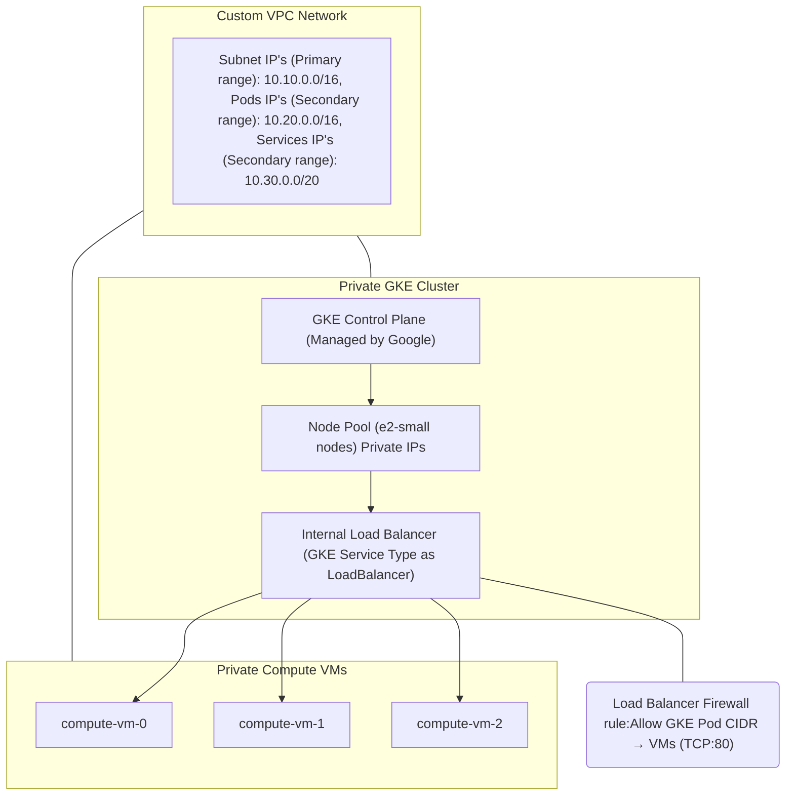

## High level architecture for load balancing 3 VM's using GKE Cluster

### Steps followed for creating terraform files - from local
1. Create main.tf and create resources one by one at every step using validate terraform plan, terraform apply

2. Create output.tf to output the resource detail at every step as applicable

3. Once the resources are created, ensure reusable variables such as project, region, zone, vpc, subnet, vm, vm size etc are moved to variables.tf. 

4. #### kubectl Setup

    *From Google Cloud Shell, Install kubectl if not available for deploying Load balancer*

    1. Run Google Cloud shell from local as Administrator

        `gcloud components install gke-gcloud-auth-plugin`

    2. Verify if installed

        `gke-gcloud-auth-plugin --version`

5. #### Create YAML files for deploying ILB

    service.yaml, deployment.yaml, configmap.yaml in another folder *k8s/lb*

    deployment.yaml - deploys proxy pod "vm-proxy" app with enginx containers 

    service.yaml - Create service for an internal load balancer for deployed app "vm-proxy"

    configmap.yaml - Configuration for three VM's listening on port 80

**Steps followed for verification of resources - Google Cloud SDK**

1. Verify if cluster was created:

    `gcloud container clusters get-credentials private-gke-cluster --region=asia-east1`

2. Verify Kubernetes resources:

    `kubectl get deployments`
    `kubectl get pods`
    `kubectl get svc`

3. Verify nodes:

    `kubectl get nodes`

4. Get more details on a node:

    `kubectl describe node <node-name>`

5. Confirm LB and Status:

    `kubectl get svc vm-proxy`

6. Describe LB :

    `kubectl describe svc vm-proxy`

### Troubleshooting:

1. Test if load balancer is working inside GKE:

    a. Enter into bash:

    `kubectl run curl-test --rm -it --image=alpine --restart=Never -- sh`

    b. Inside pod, check if LB is working and round robin message received from the 3 VM's:

    `apk add --no-cache curl
    curl http://<INTERNAL_LB_IP>`

    c. If LB is not working, check directly if VM is responding:

    `curl http://<VM 1 IP>
    curl http://<VM 2 IP>
    curl http://<VM 3 IP>`

    (or)

    c. SSH into one VM and check if it returns Hello message:

    `gcloud compute ssh compute-vm-0 --tunnel-through-iap --zone=asia-east1-c`
    `curl localhost`

2. If VM's are responding, Check proxy pod logs if there are issues with ILB reaching VM's:

    `kubectl logs deploy/vm-proxy`

3. Check if firewall rule was created for GKE prod to reach VM's on port 80:

    gcloud compute firewall-rules list --filter="network=private-vpc"

4. If Firewall rule not available, To create firewall rule for allowing requests from Secondary CIDR (services) to VM's on port 80:

    `gcloud compute firewall-rules create allow-gke-to-vms --network=private-vpc --allow=tcp:80 --source-ranges=10.20.0.0/16 --target-tags=backend-vms`

5. Ensure back end VM's also have the same network tag

    Verify tag:

    `gcloud compute instances describe backend-vm-0 --format="get(tags.items)"`

    Update tag:

    gcloud compute instances add-tags backend-vm-0 --tags=backend-vms

6. To check config map:

    `kubectl describe configmap vm-proxy-conf`

    If ConfigMap is updated, delete and restart the proxy pod:

    `kubectl delete pod -l app=vm-proxy`

7. To Deploy the Loadbalancer, provide path where the yaml files are availavle:

    `kubectl apply -f C:/Users/OrCon/GitHub/data-eng/k8s/lb/`

8. To resize the clusters and make the number of nodes as zero:

    `gcloud container clusters resize private-gke-cluster --num-nodes=0 --region=asia-east1`

